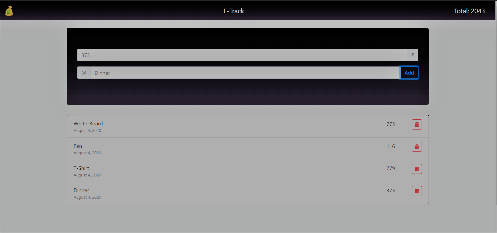

<!-- # Expense_Manager_App -->
<h1 id="top" align="center"> Expense_Manager_App </h1>
<h2 id="intro"> A responsive Expense Manager App which keeps a track of the expenses made on various dates of a month.</h2>
Here is the front page view of my app:
 

## Technologies Used: 
* HTML5
* CSS
* JavaScript
* Bootstrap

### Link: [Expense_App](https://supriya-anand.github.io/Expense_Manager_App/)

[BACK TO TOP ↑](#top)
